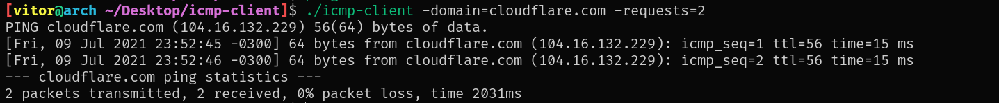

# Icmp client

A very simplified IPv4 ping clone written in Golang for Linux systems.

## How it works

- It implements the [IPv4 protocol](https://datatracker.ietf.org/doc/html/rfc791#section-3.1) and the ECHO and ECHO REPLY message formats of the [ICMP protocol](https://datatracker.ietf.org/doc/html/rfc792).

- It accepts IPv4 addresses and domain names, such as google.com, microsoft.com, etc.

- It uses a default packet size of 84 bytes (IPv4 (20 bytes) + ICMP[headers (8 bytes) + [data + padding] (56 bytes)]).

- The `data` field contains a [`struct timeval`](https://renenyffenegger.ch/notes/development/languages/C-C-plus-plus/C/libc/structs/timeval) with the current timestamp.

## Build

To build this software, you will need root priviledges. The root priviledges are necessary because of the use of raw sockets that require a special capability called: `CAP_NET_RAW`.

In your terminal type: `sudo make`.

## Input

Currently, the accepted parameters are:

- `-domain=<ipv4 address|domain name address>`

-  `-requests=<amount of requests>`. Default is 2 requests

## Screenshot

